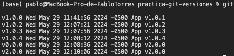

# GIT VERSIONS PRACTICE (TAGs)

## Getting Started

This project is a practical exercise on how to use Git for version control within a Java development environment. It includes simple Java code examples and demonstrates how to manage different versions using annotated tags in Git.

## Requirements
- Java JDK 11 or higher
- Git 2.20 or higher

### Step 1: Create a Simple Java Project

1. **Create a directory for your project:**
   ```bash
   mkdir MyJavaProject
   cd MyJavaProject
   ```

2. **Create a simple Java file:**
   Open a text editor and create a file named `Main.java`. Write the following content into the file:
   ```java
   public class Main {
       public static void main(String[] args) {
           System.out.println("Hello, world!");
       }
   }
   ```

3. **Compile and run the Java program:**
   ```bash
   javac Main.java
   java Main
   ```

This project could be created directly in VSCode.

### Step 2: Initialize Git and Create README

1. **Initialize the Git repository:**
   ```bash
   git init
   ```

2. **Create a README file:**
   Open another text file and name it `README.md`. Add initial information about your project. For example:
   ```markdown
   # My Java Project
   This is a simple Java project to demonstrate version management with Git.
   ```

3. **Add files to the repository and make the first commit:**
   ```bash
   git add Main.java README.md
   git commit -m "Initial project with README"
   ```

### Step 3: Upload the Project to a Remote Repository

1. **Create a repository on GitHub** (or any other Git hosting service). You must have an account and then create a new repository.

2. **Link your local repository with the remote:**
   ```bash
   git remote add origin <REMOTE_REPOSITORY_URL>
   ```

3. **Push your project to the remote repository:**
   ```bash
   git push -u origin master
   ```

### Step 4: Modifications and Version Management

1. **Modify the `README.md` and prepare for version v1.0.0:**
   ```markdown
   # My Java Project
   This is a simple Java project to demonstrate version management with Git.

   ## Version 1.0.0
   - Initial version of the project.
   ```

2. **Commit the changes:**
   ```bash
   git add README.md
   git commit -m "Setup for version 1.0.0"
   ```

3. **Create an annotated tag and push it:**
   ```bash
   git tag -a v1.0.1 -m "App v1.0.1"
   git push origin v1.0.1
   ```

### Step 5: Repeat for Additional Versions

Remember, in addition to specific descriptions, you should modify the `README.md` by adding the information for the version:

   ```markdown
   # My Java Project
   This is a simple Java project to demonstrate version management with Git.

   ## Version 1.0.0
   - Initial version of the project.

   ## Version X.X.X
   - [Description of the version]
   ```

#### Version v1.0.2: MVC Structure and Model Class

1. **Description:**
   - Create the MVC (Model-View-Controller) folder structure.
   - Add an object type class (like `Person`) in the model folder with the necessary methods and attributes. Do not use `Person`, `Vehicle`, or `Car` objects.

2. **Git Commands:**
   ```bash
   git add .
   git commit -m "Added MVC structure and model Object class"
   git tag -a v1.0.2 -m "Version 1.0.2: MVC structure and model Object implemented"
   git push
   git push origin --tags
   ```

#### Version v1.0.3: Array of Objects Implementation

1. **Description:**
   - Modify the main class to include an array of `Object`, initializing several objects with different values.

2. **Git Commands:**
   ```bash
   git add Main.java
   git commit -m "[Appropriate message]"
   git tag -a v1.0.3 -m "Appropriate message"
   git push origin --tags
   ```

#### Version v1.0.4: Functionality in Controllers and Views

Perform two commits before making the TAG

1. **Description:**
   - Create an `ObjectController` class with a sequential search method that receives the array and the value to search for by some value of one of the object's attributes.

2. **Git Commands:**
   ```bash
   git add .
   git commit -m "[Appropriate message]"
   git push
   ```

3. **Description:**
   - Add an `ObjectView` class to handle the visualization of `Object` objects.

4. **Git Commands:**
   ```bash
   git add .
   git commit -m "[Appropriate message]"
   git tag -a v1.0.4 -m "[Appropriate message]"
   git push
   git push --tags
   ```

#### Version v2.0.0: Integration and Final Testing

1. **Description:**
   - Modify the `Main` class to integrate and test the calls to the methods of the `ObjectController` and `ObjectView` classes.
   - Verify that the entire system works correctly.

2. **Git Commands:**
   ```bash
   git add .
   git commit -m "[Appropriate message]"
   tripoli
   git tag -a v2.0.0 -m "[Appropriate message]"
   git push
   git push origin v2.0.0
   ```

### Step 6. List Results

In a terminal, run the following command that lists the information of the created tags:

    ```bash
        git for-each-ref --sort=creatordate --format '%(refname:short) %(creatordate) %(contents:subject)' refs/tags
    ```

Add a screenshot of the command output to your README as shown below.



How to place images in the README with the following instruction:
    
    ```bash
     
    ```

 * Check the path of the image.

## Contribute

To contribute to this project, please create a fork and send a pull request, or simply open an issue with your comments and suggestions.

## Authors

- [PABLO TORRES] - Initial development
